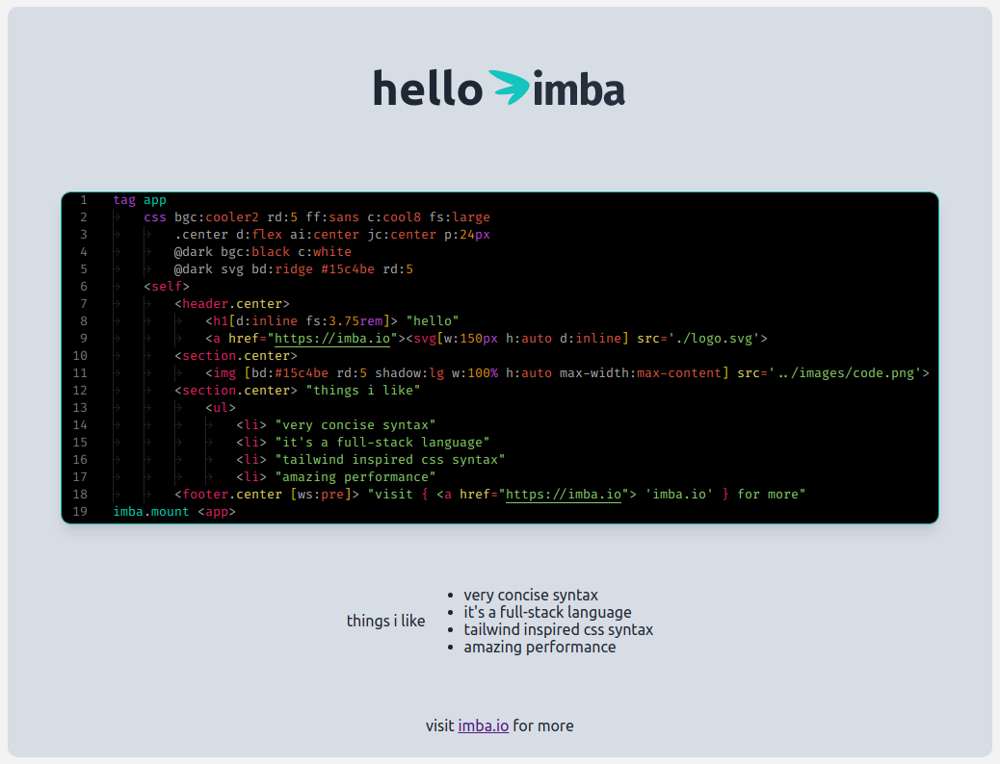

<div align = "center">

<h1><a href="https://2kabhishek.github.io/hello-imba">hello-imba</a></h1>

<a href="https://github.com/2KAbhishek/hello-imba/blob/main/LICENSE">
 </a>

<a href="https://github.com/2KAbhishek/hello-imba/graphs/contributors">
 </a>

<a href="https://github.com/2KAbhishek/hello-imba/stargazers">
</a>

<a href="https://github.com/2KAbhishek/hello-imba/network/members">
 </a>

<a href="https://github.com/2KAbhishek/hello-imba/watchers">
 </a>

<a href="https://github.com/2KAbhishek/hello-imba/pulse">
 </a>

<h3>Says hello to imba 🧑‍💻👋🏻</h3>

<figure>
  
  <br/>
  <figcaption>hello-imba screenshot</figcaption>
</figure>

</div>

## What is this

hello-imba is a demo project exploring [imba](https://imba.io/).

## Prerequisites

Before you begin, ensure you have met the following requirements:

- You have installed the latest version of `npm`

## Getting hello-imba

To get hello-imba, follow these steps:

```bash
git clone https://github.com/2kabhishek/hello-imba
cd hello-imba
npm install
```

## Using hello-imba

Use this repo for exploring imba.

Hit the ⭐ button if you found this useful.

## More Info

<div align="center">

<a href="https://github.com/2KAbhishek/hello-imba">Source</a> |
<a href="https://2kabhishek.github.io/hello-imba">Website</a>

</div>
